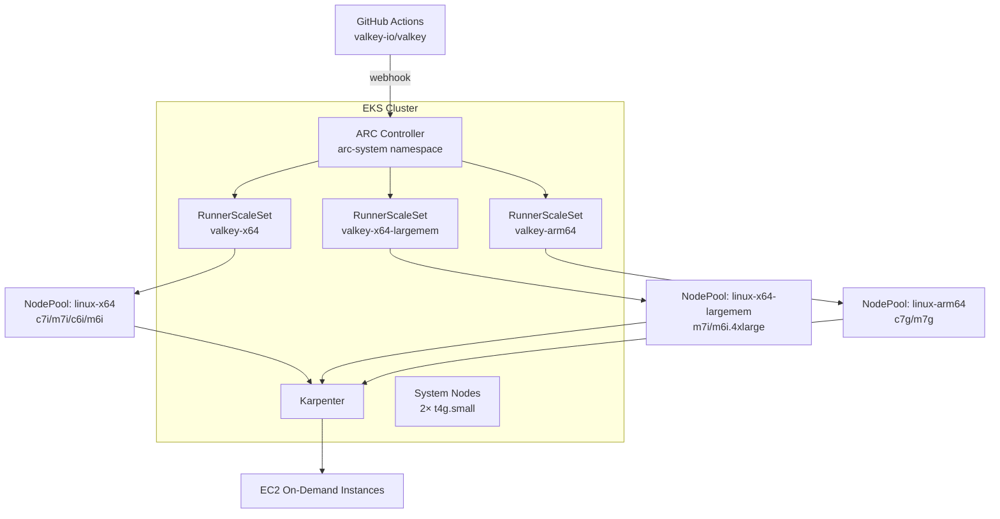

# Valkey CI — Self-Hosted GitHub Actions Runners on EKS

Deploys an EKS cluster with Karpenter for auto-scaling and Actions Runner Controller (ARC) to run valkey-io/valkey CI workloads on self-hosted runners. Three runner pools handle the ~49 parallel jobs from daily.yml: standard x64 (with Docker-in-Docker for container jobs), large-memory x64 for sanitizer/Valgrind jobs, and a dedicated ARM64 pool with eviction protection.

## Prerequisites

- AWS CLI configured with appropriate credentials
- kubectl
- Helm 3
- Terraform >= 1.7
- A GitHub App (see below)

## GitHub App Setup

1. Create a GitHub App at https://github.com/organizations/valkey-io/settings/apps/new
2. Set the following permissions:
   - **Repository permissions:**
     - Actions: Read
     - Administration: Read & Write (required for self-hosted runners)
   - **Organization permissions:**
     - Self-hosted runners: Read & Write
3. Install the app on the `valkey-io/valkey` repository
4. Note the **App ID** (Settings → General)
5. Note the **Installation ID** (from the installation URL: `https://github.com/settings/installations/<ID>`)
6. Generate and download a **private key** (Settings → General → Private keys)

## Quick Start

```bash
cp terraform.tfvars.example terraform.tfvars
# Edit terraform.tfvars with your values

terraform init
terraform plan
terraform apply
```

## Post-Deploy Verification

```bash
# Update kubeconfig
aws eks update-kubeconfig --name valkey-ci --region us-east-1

# Check system nodes
kubectl get nodes -l node-role=system

# Check Karpenter
kubectl get nodepools
kubectl get ec2nodeclasses

# Check ARC
kubectl get pods -n arc-system
kubectl get autoscalingrunnersets -n arc-runners
kubectl get pods -n arc-runners

# Trigger test workflow
gh workflow run test-runners.yml --repo valkey-io/valkey
```

## Workflow Changes

Update `runs-on` in your workflows:

```diff
 jobs:
   build:
-    runs-on: ubuntu-latest
+    runs-on: valkey-x64

   sanitizer:
-    runs-on: ubuntu-latest
+    runs-on: valkey-x64-largemem

   arm64:
-    runs-on: [self-hosted, linux, arm64]
+    runs-on: valkey-arm64
```

## Runner Pools

| Pool | Label | Instance Types | Use Case |
|------|-------|---------------|----------|
| x64 | `valkey-x64` | c7i/m7i/c6i/m6i .2xl-.4xl | Standard builds, container jobs (DinD) |
| x64-largemem | `valkey-x64-largemem` | m7i/m6i .4xlarge | ASan/UBSan, Valgrind (≥16GB RAM) |
| arm64 | `valkey-arm64` | c7g/m7g .2xl-.4xl | Native ARM64 builds (no eviction) |

## EC2 Quota Increases

Request On-Demand quota increases in your region for:

| Instance Family | vCPU Quota Needed |
|----------------|-------------------|
| C7i / M7i (Standard x64) | 400 |
| M7i / M6i (Large-mem x64) | 128 |
| C7g / M7g (ARM64) | 16 |

Service Quotas → Amazon EC2 → "Running On-Demand Standard (A, C, D, H, I, M, R, T, Z) Instances"

## Cost Estimate (us-east-1)

All on-demand, scales to zero when idle.

| Component | Idle Cost | Peak Cost (49 jobs) |
|-----------|-----------|-------------------|
| EKS control plane | ~$73/mo | ~$73/mo |
| System nodes (2× t4g.small) | ~$24/mo | ~$24/mo |
| x64 runners (up to 40× c7i.2xlarge) | $0 | ~$13.60/hr |
| x64-largemem (up to 10× m7i.4xlarge) | $0 | ~$6.45/hr |
| arm64 (up to 2× c7g.2xlarge) | $0 | ~$0.58/hr |
| **Monthly baseline** | **~$97/mo** | **+ compute per CI run** |

## Architecture


