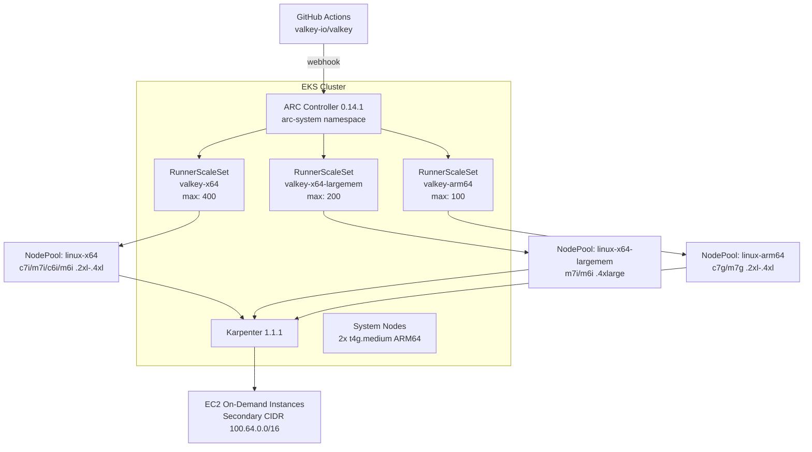

# Valkey CI — Self-Hosted GitHub Actions Runners on EKS

Deploys an EKS cluster with Karpenter for auto-scaling and Actions Runner Controller (ARC) to run valkey-io/valkey CI workloads on self-hosted runners. Three runner pools handle the parallel jobs from daily.yml with dedicated compute per job (matching GitHub-hosted runner specs).

## Design

- **No custom runner image** — uses `ghcr.io/actions/actions-runner:latest` directly
- **No Docker-in-Docker** — container-based workflow jobs (alpine, rpm-distros) stay on GitHub-hosted `ubuntu-latest`
- **Runs as root** with sudoers configured at pod startup — enables `sudo apt-get install` without workflow changes
- **HTTPS apt sources** — forced at pod startup to avoid HTTP connectivity issues through NAT
- **Scale to zero** — no runner nodes when idle, Karpenter provisions on demand
- **Dedicated compute** — each runner pod gets 4 vCPU / 16 GiB (x64/arm64) or 8 vCPU / 32 GiB (largemem), matching GitHub-hosted specs

## Architecture



## Runner Pools

| Pool | Label | Instance Types | Resources/Pod | Use Case |
|------|-------|---------------|---------------|----------|
| x64 | `valkey-x64` | c7i/m7i/c6i/m6i .2xl-.4xl | 4 vCPU, 16 GiB | Standard builds, TLS, io-threads, valgrind, sanitizers |
| x64-largemem | `valkey-x64-largemem` | m7i/m6i .4xlarge | 8 vCPU, 32 GiB | ASan/UBSan large-memory, Valgrind large-memory |
| arm64 | `valkey-arm64` | c7g/m7g .2xl-.4xl | 4 vCPU, 16 GiB | Native ARM64 builds |

## Jobs that stay on GitHub-hosted runners

These jobs use Docker containers or QEMU emulation and remain on `ubuntu-latest`:

- `test-freebsd` (QEMU x86 emulation, needs fdisk)
- `test-s390x` (QEMU s390x emulation via run-on-arch-action)
- `test-ubuntu-jemalloc-fortify` (container: ubuntu:noble)
- `test-rpm-distros-*` (container: almalinux/centos/fedora)
- `test-alpine-*` (container: alpine)

## Prerequisites

- AWS CLI configured with appropriate credentials
- kubectl
- Helm 3
- Terraform >= 1.7
- A GitHub App (see below)

## GitHub App Setup

1. Create a GitHub App at https://github.com/organizations/valkey-io/settings/apps/new
2. Set the following permissions:
   - **Repository permissions:**
     - Actions: Read
     - Administration: Read & Write (required for self-hosted runners)
   - **Organization permissions:**
     - Self-hosted runners: Read & Write
3. Install the app on the `valkey-io/valkey` repository
4. Note the **App ID**, **Installation ID**, and generate a **private key**

## Quick Start

```bash
cp terraform.tfvars.example terraform.tfvars
# Edit terraform.tfvars with your values

terraform init
terraform plan
terraform apply
```

## Post-Deploy Verification

```bash
aws eks update-kubeconfig --name valkey-ci --region us-east-1

# Check system nodes
kubectl get nodes -l node-role=system

# Check Karpenter
kubectl get nodepools
kubectl get ec2nodeclasses

# Check ARC
kubectl get pods -n arc-system
kubectl get autoscalingrunnersets -n arc-runners

# Trigger a test
gh workflow run daily.yml --repo valkey-io/valkey -f 'skipjobs=none' -f 'skiptests=none'
```

## Workflow Changes

Update `runs-on` in daily.yml for native build jobs:

```diff
 jobs:
   test-ubuntu-jemalloc:
-    runs-on: ubuntu-latest
+    runs-on: valkey-x64

   test-sanitizer-address-large-memory:
-    runs-on: ubuntu-latest
+    runs-on: valkey-x64-largemem

   test-ubuntu-arm:
-    runs-on: [self-hosted, linux, arm64]
+    runs-on: valkey-arm64
```

Container-based jobs (alpine, rpm-distros, freebsd, s390x) stay on `ubuntu-latest`.

## EC2 Quota Increases

Request On-Demand quota increases in us-east-1:

| Instance Family | vCPU Quota Needed |
|----------------|-------------------|
| C7i / M7i / C6i / M6i (x64) | 3200 |
| M7i / M6i (largemem) | 3200 |
| C7g / M7g (ARM64) | 800 |

## Cost Estimate (us-east-1)

Scales to zero when idle.

| Component | Idle Cost | Peak Cost |
|-----------|-----------|-------------------|
| EKS control plane | ~$73/mo | ~$73/mo |
| System nodes (2× t4g.medium) | ~$48/mo | ~$48/mo |
| x64 runners (up to 400 pods) | $0 | ~$100+/hr |
| x64-largemem (up to 200 pods) | $0 | ~$100+/hr |
| arm64 (up to 100 pods) | $0 | ~$30/hr |
| **Monthly baseline** | **~$121/mo** | **+ compute per CI run** |

## Networking

- VPC: `10.0.0.0/16` (primary) + `100.64.0.0/16` (secondary CIDR for Karpenter)
- Karpenter subnets: 2× /18 in the secondary CIDR (16K IPs each)
- Single NAT gateway for internet egress
- Runner pods force HTTPS for apt sources to avoid HTTP timeout issues through NAT
